```{r setup, include=FALSE}
options(htmltools.dir.version = FALSE)
```


```{r xaringan-themer, include=FALSE, warning=FALSE}
library(xaringanthemer)
style_mono_accent(
  base_color = "#1c5253",
  header_font_google = google_font("Josefin Sans"),
  text_font_google   = google_font("Montserrat", "300", "300i"),
  code_font_google   = google_font("Fira Mono")
)
#.center[<span style="color:coral">**Quality of proxy information matters.**</span>]
```


# Outline


### 1. hdPS

- General idea

### 2. Machine learning-based hdPS

- [Karim et al. 2018](https://doi.org/10.1097/ede.0000000000000787) Epidemiology
- Joint work with  
  - .red[Menglan Pang] and .red[Robert W Platt]
  - McGill, CNODES Methods; Fund CIHR, Grant #DSE – 146021
- General idea

### 3. Related research

- not exhaustive

---

class: inverse, center, middle

# hdPS

---

## Motivating Example


[Basham et al. 2021](https://doi.org/10.1016/j.eclinm.2021.100752) EClinicalMedicine: [CC BY license](http://creativecommons.org/licenses/by/4.0/)

```{r echo=FALSE, out.width='80%', fig.align="center"}
knitr::include_graphics('images/tbdag.png')
```

---

## Health care database: Advantages vs Disadvantages


.pull-left[
1. Larger .red[sample size];

1. Diverse population;

1. .red[Longitudinal records] /many years;

1. .red[Detailed] health encounters, comorbidity history, drug exposure history;

1. possibility to .red[link] other databases.
]

.pull-right[
1. Not specifically designed for answering a particular .red[research question];

1. .red[Data sparsity]: data collection relies on visits and encounters;

1. No control over which factors were measured.
]

.footnote[TLDR: .red[**May not have all confounders**].]


---

## Principles of confounder selection

**Modified disjunctive cause criterion**

Adjust for variables that are 
- causes of exposure or outcome or both,  
- discard: known instrument, 
- including .red[good proxies] for unmeasured common causes

[VanderWeele et al. 2019](https://doi.org/10.1007/s10654-019-00494-6) European Journal of Epidemiology: [CC BY license](http://creativecommons.org/licenses/by/4.0/)

```{r echo=FALSE, out.width='80%', fig.align="center"}
knitr::include_graphics('images/proxy.png')
```

---

## High-dimensional proxy information

[Schneeweiss et al. 2018](https://dx.doi.org/10.2147/CLEP.S166545) Clinical Epidemiology: [CC BY license](http://creativecommons.org/licenses/by-nc/3.0/)

```{r echo=FALSE, out.width='100%', fig.align="center"}
knitr::include_graphics('images/hdpscov.png')
```

---

## High-dimensional proxy information

- Adjusting for something that **may not be interpretable** directly with the context of the research question. 

- .red[**Logic**]: measures from same subject should be **correlated** = relevant proxy information


```{r cite, cache= TRUE, echo= FALSE, warning=FALSE, message=FALSE, fig.align="center",out.width='50%'}
library(scholar)
SSalzberg <- "XzOhFPoAAAAJ"
all_pubs <- get_publications(SSalzberg)
## next step is cosmetic -- the equivalent of stringsAsFactors=FALSE
all_pubs <- as.data.frame(lapply(all_pubs,
                                 function(x) if (is.factor(x)) as.character(x) else x))
ch <- get_article_cite_history(SSalzberg,"eQOLeE2rZwMC")
vals <- ch$cites
names(vals) <- ch$year
mp <- barplot(vals,ylim=c(0,130))
title("Citation of Schneeweiss et al. (2009)")
text(mp, vals, labels = vals, pos = 3)
```


---


## hdPS: General Idea

Collection of proxy data for the unmeasured + mis-measured variables:

```{r echo=FALSE, out.width='90%', fig.align="center"}
knitr::include_graphics('images/proxy330.png')
```

```{r echo=FALSE, out.width='80%', fig.align="center"}
knitr::include_graphics('images/fu.png')
```

---

## hdPS: General Idea

Collection of proxy data for the unmeasured + mis-measured variables:

```{r echo=FALSE, out.width='90%', fig.align="center"}
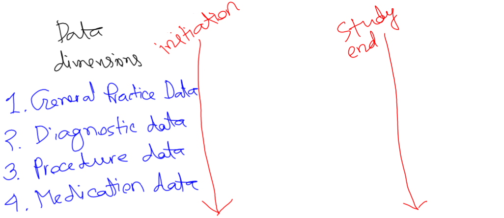
```

```{r echo=FALSE, out.width='80%', fig.align="center"}
knitr::include_graphics('images/fu.png')
```

---

## hdPS: General Idea

Collection of proxy data for the unmeasured + mis-measured variables:

```{r echo=FALSE, out.width='90%', fig.align="center"}
knitr::include_graphics('images/proxy33.png')
```

```{r echo=FALSE, out.width='80%', fig.align="center"}
knitr::include_graphics('images/fu.png')
```

---

## hdPS: General Idea

List of additional proxy variables (empirical covariates / EC):

| Practice (Dimension 1)             | Diagnostic (Dimension 2)           | Procedure (Dimension 3)           | Medication (Dimension 4)           |
|----------------------|----------------------|---------------------|----------------------|
| EC-dim1-1-once       | EC-dim2-1-once       | EC-dim3-1-once      | EC-dim4-1-once       |
| EC-dim1-1-sporadic   | EC-dim2-1-sporadic   | EC-dim3-1-sporadic  | EC-dim4-1-sporadic   |
| EC-dim1-1-frequent   | EC-dim2-1-frequent   | EC-dim3-1-frequent  | EC-dim4-1-frequent   |
| $\ldots$             | $\ldots$             | $\ldots$            | $\ldots$            |
| EC-dim1-.red[686]-frequent | EC-dim2-.red[328]-frequent | EC-dim3-.red[76]-frequent | EC-dim4-.red[284]-frequent |


- Total (686+328+76+284)*3 = .red[4,122 ECs]
- 4 dimension $\times$ 3 intensity $\times$ 200 most prevalent codes [*] = .red[**2,400 ECs**]
- [Schuster et al. (2015)](https://doi.org/10.1002/pds.3773) PDS 
  - recommended omitting prevalence-based selection 
- no/less variability in a variable is a problem

---

## hdPS: General Idea

```{r echo=FALSE, out.width='100%', fig.align="center"}
knitr::include_graphics('images/psmodelks.png')
```


.pull-left[
PS from only baseline confounders 
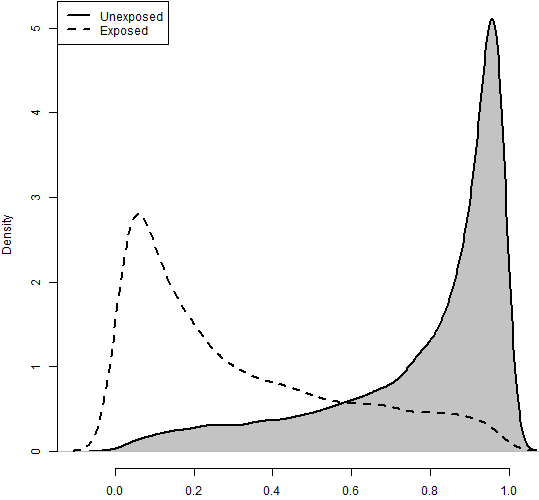
]
.pull-right[
PS from kitchen sink model!

]


---
## hdPS mechanism: find useful ECs


```{r echo=FALSE, out.width='95%', fig.align="left"}
knitr::include_graphics('images/eq1.png')
```

.pull-left[
In our example, 
$$
\begin{aligned}
U &=& \text{smoking status}
\end{aligned}
$$
]
.pull-right[
- [Bross (1966)](https://pubmed.ncbi.nlm.nih.gov/5966011/) formula requires
  - binary U
  - binary Y
  - binary A
]  
---


## hdPS mechanism: find useful ECs


```{r echo=FALSE, out.width='100%', fig.align="left"}
knitr::include_graphics('images/eq2.png')
```

.pull-left[In our example, 
$$
\begin{aligned}
EC &=& \text{EC-dim1-21-once} \\
&=& \text{EC-dim2-95-once} \\
&&  \ldots\\
&=& \text{EC-dim4-64-once}
\end{aligned}
$$
]

.pull-right[
- [Bross (1966)](https://pubmed.ncbi.nlm.nih.gov/5966011/) formula requires
  - binary EC
  - binary Y
  - binary A
] 
---

## hdPS mechanism: find useful ECs

Rank (descending) each EC by the magnitude of log-bias: Absolute  log $Bias_M$


| Rank by bias | Absolute log $Bias_M$ | EC |
|--------------|-------------------------|----------------------|
| 1            | 0.42                    | EC-dim1-21-once      |
| 2            | 0.32                    | EC-dim2-95-once      |
| 3            | 0.25                    | EC-dim4-289-once     |
| $\ldots$     | $\ldots$                | $\ldots$             |
| 2,400        | 0.01                    | EC-dim4-64-frequent  |


Take top .red[100 or 500] of these ECs. These are hdPS variables.

```{r echo=FALSE, out.width='100%', fig.align="center"}
knitr::include_graphics('images/psmodelhd.png')
```

---

## hdPS: Assumption

.large[
- **The selected ECs collectively serve as .red[proxies of all unmeasured or residual confounders]**

- **Implication**: an hdPS analysis may adjust for the unmeasured or residual confounders

- This assumption is strong and often not verifiable.

]


---

## hdPS: Balance

.pull-left[
PS from kitchen sink model!

]
.pull-right[
PS from 500-hdPS!

]

---

## hdPS: estimate treatment effect

- [Karim et al. 2018](https://doi.org/10.1097/ede.0000000000000787) Epidemiology
- Previous research: [Pang et al. (2016)](https://dx.doi.org/10.1097%2FEDE.0000000000000487): Epidemiology


```{r echo=FALSE, out.width='100%', fig.align="left"}
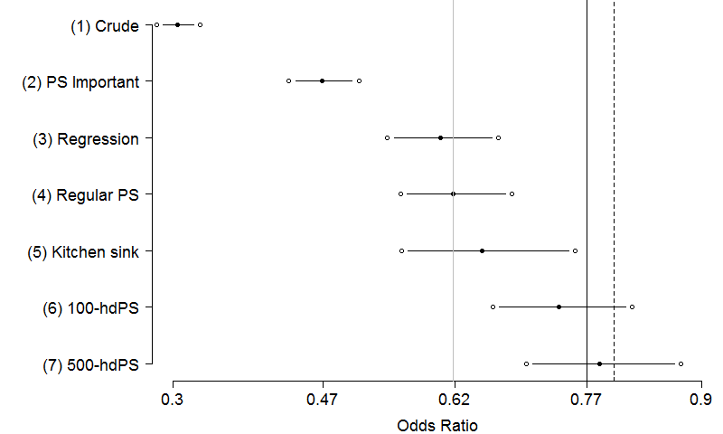
```


---


## hdPS: Ways to improve

| Rank by bias | Absolute log $Bias_M$ | EC |
|--------------|-------------------------|----------------------|
| 1            | 0.42                    | EC-dim1-21-once      |
| 2            | 0.32                    | EC-dim2-95-once      |
| 3            | 0.25                    | EC-dim4-289-once     |
| $\ldots$     | $\ldots$                | $\ldots$             |
| 500        | 0.03                    | EC-dim4-63-frequent  |


- ECs selected separately / .red[univatiately] [VanderWeele et al. 2019](https://doi.org/10.1007/s10654-019-00494-6) EJE
    - can be **correlated** (coming from same patient), 
      - providing same information
      - **may not be useful anymore** in the presence of others

- .red[Multivariate] structure is good to consider
  - Model-specification

---

class: inverse, center, middle

# Machine learning-based hdPS


---

## Variable selection in PS context

.pull-left[
- [Brookhart et al. (2006)](https://doi.org/10.1093/aje/kwj149) AJE

- [Myers et al. (2011)](https://doi.org/10.1093/aje/kwr364) AJE

- [Pearl (2011)](https://doi.org/10.1093/aje/kwr352) AJE

- [Schuster et al (2016)](https://doi.org/10.1016/j.jclinepi.2016.05.017) JCE
]

.pull-right[
- bias amplification

- inflated variance

- overfitting
]

```{r echo=FALSE, out.width='65%', fig.align="center"}
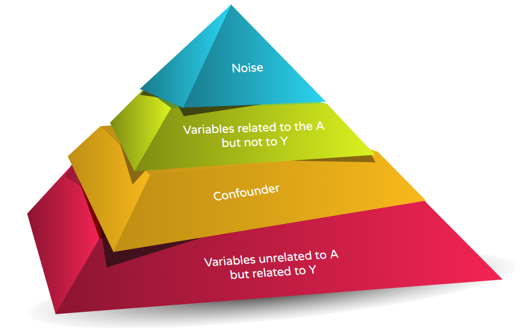
```

---

## Variable selection in PS context

```{r echo=FALSE, out.width='90%', fig.align="center"}
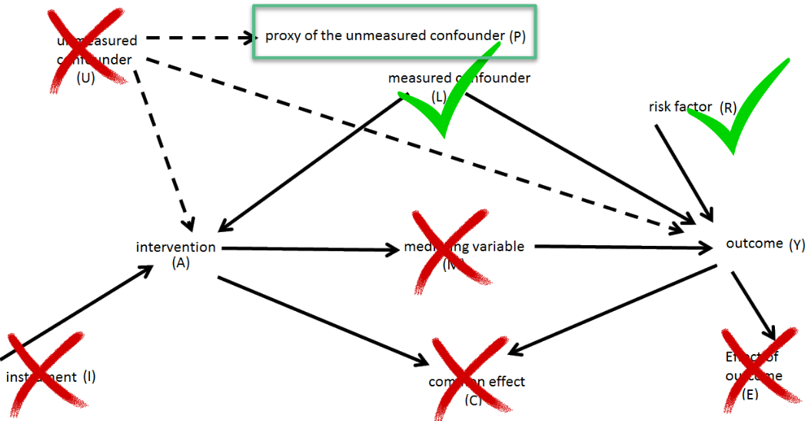
```

- Same idea for the proxies. 
- Pre-exposure measurements.

---

## Variable selection in PS context

Jointly consider all proxies in one model to perform variable selection

| Approach | Advantage | Limitations |
|--------------|-------------------------|----------------------|
| LASSO [Franklin et al. (2015)](https://doi.org/10.1093/aje/kwv108) AJE          | Variable selection by dropping .red[collinear] variables                    |   Tends to select one variable from a group, ignoring the rest     |
| Elastic net            |  More .red[stable] version than LASSO                    | Non-linear and non-additive terms need to be specified      |
| Random forest [Low et al. (2016)](https://doi.org/10.2217/cer.15.53) J. Comp. Eff. Res.          |  Automatically detect non-linearity and .red[non-additivity]                    | Only provides **variable importance**, but no cut-points     |


**Variable importance**:

```{r echo=FALSE, out.width='40%', fig.align="center"}
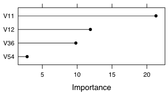
```

---

## Machine learning-based hdPS

### Pure ML approach

Start with all ECs

```{r echo=FALSE, out.width='100%', fig.align="center"}

```

Say, 100 ECs (associated with Y) were selected by Elastic net approach

```{r echo=FALSE, out.width='100%', fig.align="center"}
knitr::include_graphics('images/psmodelrefined.png')
```

---

## Machine learning-based hdPS

### Hybrid approach (hdPS, then ML)

Start with top 500 ECs selected by Bross formula / prioritization

```{r echo=FALSE, out.width='100%', fig.align="center"}
knitr::include_graphics('images/mlhybrid.png')
```

Say, 100 ECs (associated with Y) were selected by Elastic net approach

```{r echo=FALSE, out.width='100%', fig.align="center"}
knitr::include_graphics('images/psmodelrefined.png')
```

This approach is different than [Schneeweiss et al. (2017)](https://doi.org/10.1097/EDE.0000000000000581) Epidemiology, where prioritization was used after applying LASSO.


---

## hdPS vs. ML: estimate treatment effect

[Karim et al. 2018](https://doi.org/10.1097/ede.0000000000000787) Epidemiology

```{r echo=FALSE, out.width='100%', fig.align="left"}
knitr::include_graphics('images/AllOR2.png')
```

.center[.red[**Only ~ 30% of the selected hdPS covariates were common.**]]

---


## hdPS: estimate treatment effect

[Schneeweiss et al. 2018](https://dx.doi.org/10.2147/CLEP.S166545) Clinical Epidemiology: [CC BY license](http://creativecommons.org/licenses/by-nc/3.0/)

.right-column[
```{r echo=FALSE, out.width='100%', fig.align="left"}
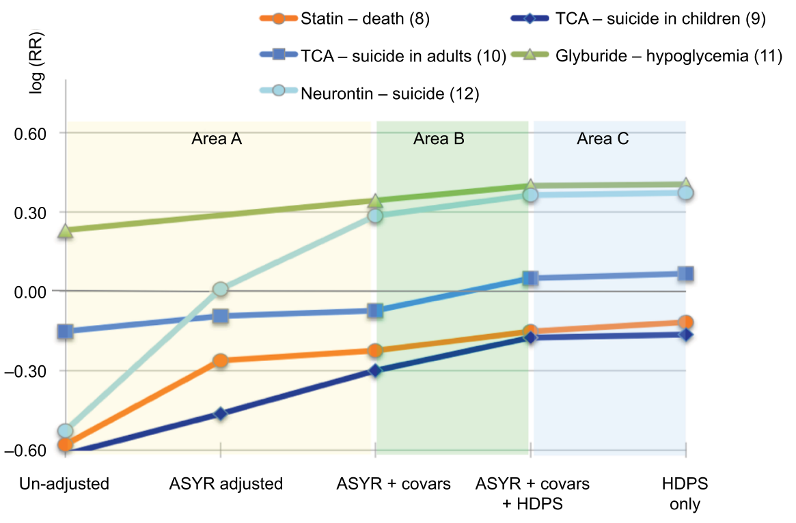
```
]

.left-column[
*"This strongly suggests that even .red[without the investigator-specifying covariates] for adjustment, the .red[algorithm alone] optimizes confounding adjustment."*
]
---

## hdPS vs. ML: estimate treatment effect

[Karim et al. 2018](https://doi.org/10.1097/ede.0000000000000787) Epidemiology

```{r echo=FALSE, out.width='100%', fig.align="left"}
knitr::include_graphics('images/AllORu.png')
```

.center[.red[**Quality of proxy information matters.**]]

---

## Plasmode Simulation

[Franklin et al. (2014)](https://doi.org/10.1016/j.csda.2013.10.018) CSDA

```{r echo=FALSE, out.width='100%', fig.align="center"}
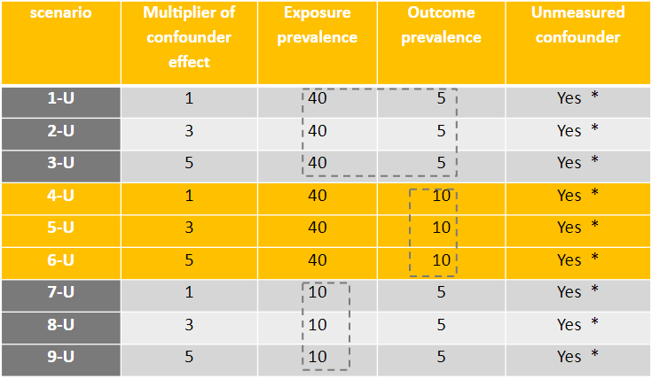
```

Another baseline set with .red[no unmeasured confounding] (1-A to 9-A).

---

## Plasmode Simulation

```{r echo=FALSE, out.width='80%', fig.align="center"}
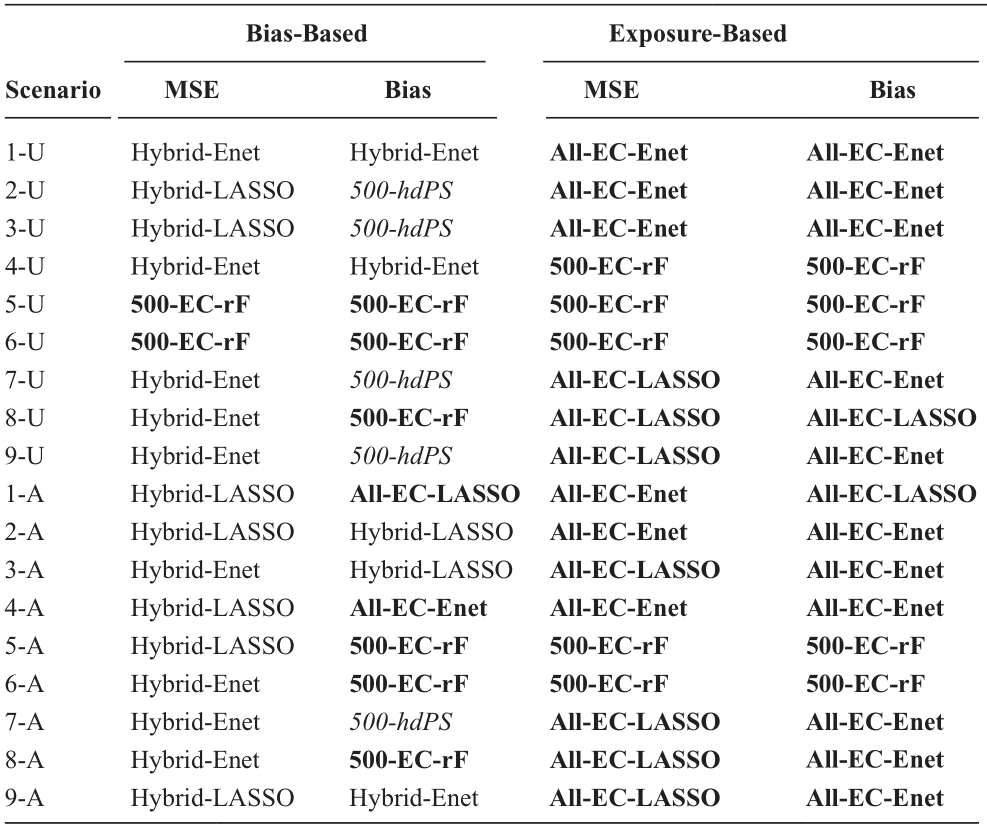
```


---

## Shared Limitations

.left-column[
- M-bias [Liu et al (2012)](https://doi.org/10.1093/aje/kws165) AJE

- Z-bias [Myers et al. (2011)](https://doi.org/10.1093/aje/kwr364) AJE
]

.right-column[
- .red[No separation] of design and analysis stages in bias-based
  - exposure-based is OK; but has own issues

- .red[EC interpretation] unclear vs. causal inference
  - not collected for research purposes
  - EC used in PS

- Primarily to deal with .red[residual confounding]
  - Not a straightforward extension to PS analysis
  - .red[Motivation of PS and hdPS are different to begin with]
  
- better covariate balance vs. overfitting
  - Varying number of covariates selected [Tazare et al. 2022](https://doi.org/10.1002/pds.5412)

- post-selection bias [Taylor and Tibshirani (2015)](https://doi.org/10.1073/pnas.1507583112)
]

---

## Advantage and Limitations

.pull-left[
- Alternative ways to prioritize / rank 
  - Automatic .red[cut-off] of how many variables 
  - .red[Ranking]

- Pure ML methods can be used for non-binary outcomes and proxies
  - binary
  - categorized
  - continuous
  - survival
]

.pull-right[
- .red[Coverage] not assessed [Morris et al. (2019)](https://doi.org/10.1002/sim.8086)

- Only a few ML methods assessed

- DR methods not covered
]

---

## Motivating Example 

Basham et al. 2021 [EClinicalMedicine](https://doi.org/10.1016/j.eclinm.2021.100752): [CC BY license](http://creativecommons.org/licenses/by/4.0/)

```{r echo=FALSE, out.width='100%', fig.align="center"}
knitr::include_graphics('images/tbanalysis.png')
```

.center[I prefer to use hdPS / ML with ECs as a .red[**secondary analysis**] (proxy adjustment method).]


---

## JAMA Example

[Brown et al. (2017)](https://doi.org/10.1001/jama.2017.3415)

| Method                 | HR                     | CI $95\%$                    |
|--|-|-|
| Unadjusted             | 2.16                   | 1.64-2.86                    |
| Regression | 1.59                   | 1.17-2.17                    |
| IPTW hdPS              | .red[1.61] | .red[0.997-2.59] |
| 1-1 hdPS matching      | 1.64                   | 1.07-2.53                    |
| Pre-pregnancy      | 1.85                   | 1.37-2.51                    |

- Conclusion: **not associated**
- More discussion: [Amrhein, Trafimow, Greenland, 2019](https://doi.org/10.1080/00031305.2018.1543137) The American Statistician

---

class: inverse, center, middle

# Related research directions

---

## Related research directions

### AI : Autoencoders

[Weberpals et al. (2021)](https://doi.org/10.1097/ede.0000000000001338) proposed to use autoencoders (3, 5, 7 layers) to reduce EC dimensions.

```{r echo=FALSE, out.width='40%', fig.align="center"}
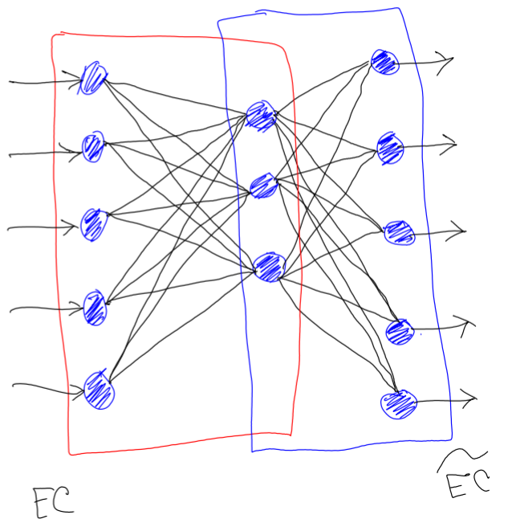
```

- Autoencoder-based hdPS is useful.
- Shallow learning (less layers) had better MSE.
- .red[Did not perform better than LASSO].

---


## Related research directions

### TMLE

Targetted learning approach
[Pang et al. (2016)](https://dx.doi.org/10.1097%2FEDE.0000000000000487): Epidemiology : [CC BY-NC-ND license](https://creativecommons.org/licenses/by-nc-nd/4.0/)

```{r echo=FALSE, out.width='60%', fig.align="center"}
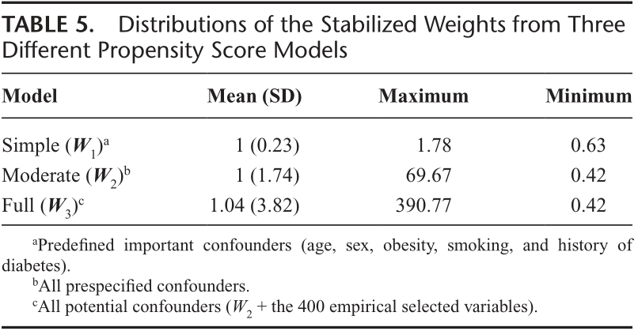
```

[Haris and Platt (2021)](https://doi.org/10.48550/arXiv.2112.08495) arxiv

- group importance score
- extension of the hdPS (.red[hdCS]) to non-binary outcome and confounders

---
## Related research directions

### Sample splitting

[Naimi et al. (2021)](https://doi.org/10.1093/aje/kwab201) AJE

SL, TMLE, AIPW and usefulness of sample splitting

- ML based .red[singly robust methods] should be avoided
- Use .red[sample splitting]
- .red[rich SL library] of flexible regression as well as higher order interactions

---

## Related research directions

### Cross-fitting

[Zivich and Breskin (2021)](https://doi.org/10.1097/ede.0000000000001332) Epidemiology

- Cross-fitting + together with double-robust approaches

```{r echo=FALSE, out.width='80%', fig.align="center"}
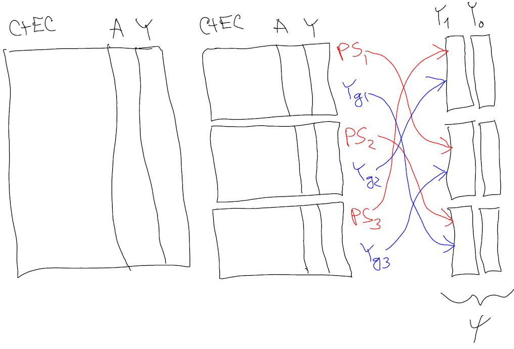
```


---
## Related research directions

### SL library

[Balzer and Westling (2021)](https://doi.org/10.1093/aje/kwab200) AJE

- TMLE without sample-splitting with a carefully chosen SL library

[Meng and Huang (2021)](https://doi.org/10.48550/arXiv.2105.13148) arxiv
- SL with .red[smooth] (differentiable: LASSO, spline) learners outperform those that included non-smooth learners


---

## Take home message

.large[
- hdPS and ML alternatives generally reduces .red[residual confounding] 
  
  - [*] if .red[good proxies] available.

- hdPS: too dependent on .red[Bross-formula] (all binary)

- Non-binary outcome: consider ML methods.

- .red[Hybrid-methods] performed better (MSE).

- Active area of research
]

---

class: center, middle

# Thanks!

### http://ehsank.com/

