```{r setup, include=FALSE}
options(htmltools.dir.version = FALSE)
```

```{r xaringan-themer, include=FALSE, warning=FALSE}
library(xaringanthemer)
style_mono_accent(
  base_color = "#1c5253",
  header_font_google = google_font("Josefin Sans"),
  text_font_google   = google_font("Montserrat", "300", "300i"),
  code_font_google   = google_font("Fira Mono")
)
```


# Outline


### 1. hdPS

- General idea

### 2. Machine learning-based hdPS

- [Karim et al. 2018](https://doi.org/10.1097/ede.0000000000000787) Epidemiology
- Joint work with  
  - Menglan Pang and Robert W Platt
  - McGill, CNODES Methods; Fund CIHR, Grant #DSE – 146021
- General idea

### 3. New research since 2018

---

class: inverse, center, middle

# hdPS

---

## Motivating Example


[Basham et al. 2021](https://doi.org/10.1016/j.eclinm.2021.100752) EClinicalMedicine: [CC BY license](http://creativecommons.org/licenses/by/4.0/)

```{r echo=FALSE, out.width='80%', fig.align="center"}
knitr::include_graphics('images/tbdag.png')
```

---

## Health care database: Advantages vs Disadvantages


.pull-left[
1. Larger sample size;

1. Diverse population;

1. Longitudinal records /many years;

1. Detailed health encounters, comorbidity history, drug exposure history;

1. possibility to link other databases.
]

.pull-right[
1. Not specifically designed for answering a particular research question;

1. Data sparsity: data collection relies on visits and encounters;

1. No control over which factors were measured.
]

.footnote[[*] TLDR: May not have all confounders in the data.]


---

## Principles of confounder selection

**Modified disjunctive cause criterion**

Adjust for variables that are 
- causes of exposure or outcome or both,  
- discard: known instrument, 
- including good proxies for unmeasured common causes

[VanderWeele et al. 2019](https://doi.org/10.1007/s10654-019-00494-6) European Journal of Epidemiology: [CC BY license](http://creativecommons.org/licenses/by/4.0/)

```{r echo=FALSE, out.width='80%', fig.align="center"}
knitr::include_graphics('images/proxy.png')
```

---

## High-dimensional proxy information

[Schneeweiss et al. 2018](https://dx.doi.org/10.2147/CLEP.S166545) Clinical Epidemiology: [CC BY license](http://creativecommons.org/licenses/by-nc/3.0/)

```{r echo=FALSE, out.width='100%', fig.align="center"}
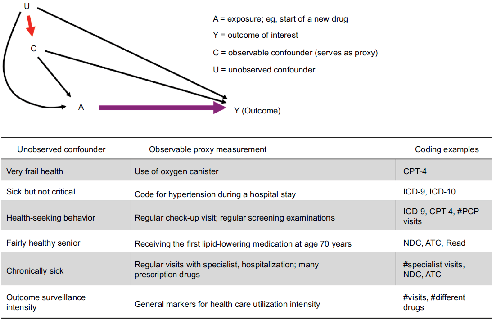
```

---

## High-dimensional proxy information

- Adjusting for something that **may not be interpretable** directly with the context of the research question. 

- Logic: measures from same subject should be **correlated** = has relevant proxy information


```{r cite, cache= TRUE, echo= FALSE, warning=FALSE, message=FALSE, fig.align="center",out.width='50%'}
library(scholar)
SSalzberg <- "XzOhFPoAAAAJ"
all_pubs <- get_publications(SSalzberg)
## next step is cosmetic -- the equivalent of stringsAsFactors=FALSE
all_pubs <- as.data.frame(lapply(all_pubs,
                                 function(x) if (is.factor(x)) as.character(x) else x))
ch <- get_article_cite_history(SSalzberg,"eQOLeE2rZwMC")
vals <- ch$cites
names(vals) <- ch$year
mp <- barplot(vals,ylim=c(0,130))
title("Citation of Schneeweiss et al. (2009)")
text(mp, vals, labels = vals, pos = 3)
```


---


## hdPS: General Idea

Collection of proxy data for the unmeasured + mis-measured variables:

```{r echo=FALSE, out.width='90%', fig.align="center"}

```

```{r echo=FALSE, out.width='80%', fig.align="center"}
knitr::include_graphics('images/fu.png')
```

---

## hdPS: General Idea

Collection of proxy data for the unmeasured + mis-measured variables:

```{r echo=FALSE, out.width='90%', fig.align="center"}
knitr::include_graphics('images/proxy330a.png')
```

```{r echo=FALSE, out.width='80%', fig.align="center"}
knitr::include_graphics('images/fu.png')
```

---

## hdPS: General Idea

Collection of proxy data for the unmeasured + mis-measured variables:

```{r echo=FALSE, out.width='90%', fig.align="center"}
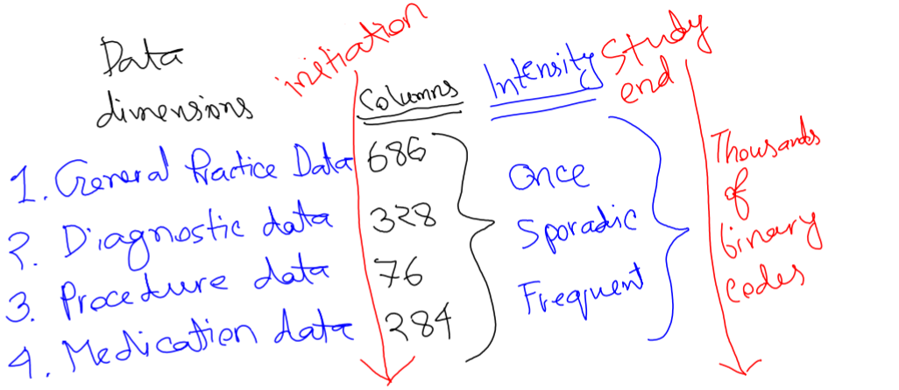
```

```{r echo=FALSE, out.width='80%', fig.align="center"}
knitr::include_graphics('images/fu.png')
```

---

## hdPS: General Idea

List of additional proxy variables (empirical covariates / EC):

| Practice (Dimension 1)             | Diagnostic (Dimension 2)           | Procedure (Dimension 3)           | Medication (Dimension 4)           |
|----------------------|----------------------|---------------------|----------------------|
| EC-dim1-1-once       | EC-dim2-1-once       | EC-dim3-1-once      | EC-dim4-1-once       |
| EC-dim1-1-sporadic   | EC-dim2-1-sporadic   | EC-dim3-1-sporadic  | EC-dim4-1-sporadic   |
| EC-dim1-1-frequent   | EC-dim2-1-frequent   | EC-dim3-1-frequent  | EC-dim4-1-frequent   |
| $\ldots$             | $\ldots$             | $\ldots$            | $\ldots$            |
| EC-dim1-686-frequent | EC-dim2-328-frequent | EC-dim3-76-frequent | EC-dim4-284-frequent |


- 4 dimension $\times$ 3 intensity $\times$ 200 most prevalent codes = 2,400 ECs

---

## hdPS: General Idea

```{r echo=FALSE, out.width='100%', fig.align="center"}
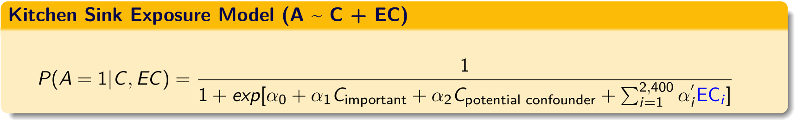
```


.pull-left[
PS from only baseline confounders 

]
.pull-right[
PS from kitchen sink model!
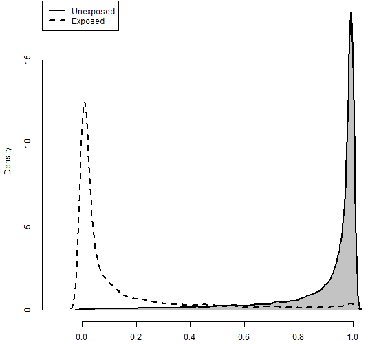
]


---
## hdPS mechanism: find useful ECs


```{r echo=FALSE, out.width='95%', fig.align="left"}
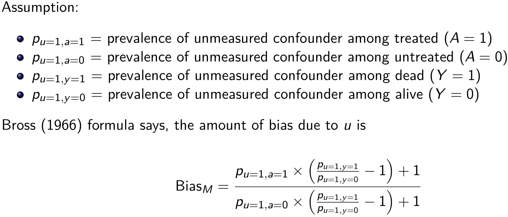
```

In our example, we use the following in the [Bross (1966)](https://pubmed.ncbi.nlm.nih.gov/5966011/) formula:
$$
\begin{aligned}
U &=& \text{smoking status}
\end{aligned}
$$

---


## hdPS mechanism: find useful ECs


```{r echo=FALSE, out.width='100%', fig.align="left"}
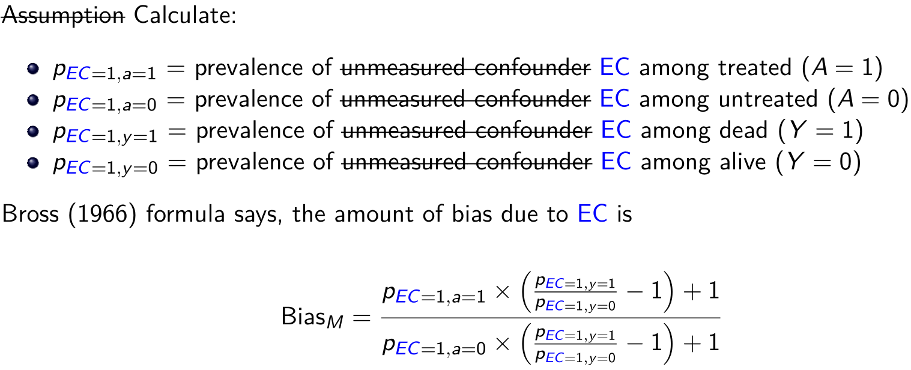
```

In our example, we use the following in the [Bross (1966)](https://pubmed.ncbi.nlm.nih.gov/5966011/) formula:
$$
\begin{aligned}
EC &=& \text{EC-dim1-21-once} \\
&=& \text{EC-dim2-95-once} \\
&&  \ldots\\
&=& \text{EC-dim4-64-once}
\end{aligned}
$$

---

## hdPS mechanism: find useful ECs

Rank (descending) each EC by the magnitude of log-bias: Absolute  log $Bias_M$


| Rank by bias | Absolute log $Bias_M$ | EC |
|--------------|-------------------------|----------------------|
| 1            | 0.42                    | EC-dim1-21-once      |
| 2            | 0.32                    | EC-dim2-95-once      |
| 3            | 0.25                    | EC-dim4-289-once     |
| $\ldots$     | $\ldots$                | $\ldots$             |
| 2,400        | 0.01                    | EC-dim4-64-frequent  |


Take top 100 or 500 of these ECs. These are hdPS variables.

```{r echo=FALSE, out.width='100%', fig.align="center"}
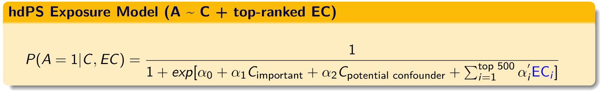
```

---

## hdPS: Balance

.pull-left[
PS from kitchen sink model!

]
.pull-right[
PS from 500-hdPS!
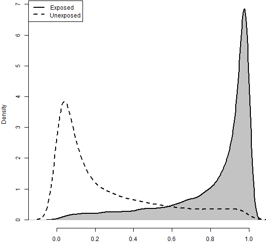
]

---

## hdPS: estimate treatment effect

[Karim et al. 2018](https://doi.org/10.1097/ede.0000000000000787) Epidemiology

```{r echo=FALSE, out.width='100%', fig.align="left"}
knitr::include_graphics('images/AllORs.png')
```

---


## hdPS: Ways to improve

| Rank by bias | Absolute log $Bias_M$ | EC |
|--------------|-------------------------|----------------------|
| 1            | 0.42                    | EC-dim1-21-once      |
| 2            | 0.32                    | EC-dim2-95-once      |
| 3            | 0.25                    | EC-dim4-289-once     |
| $\ldots$     | $\ldots$                | $\ldots$             |
| 500        | 0.03                    | EC-dim4-63-frequent  |


- ECs selected separately / univatiately
    - can be **correlated** (coming from same patient), 
      - providing same information
      - **may not be useful anymore** in the presence of others
    - may inflate **variance**.
- Multivariate structure is good to consider
- Model-specification

---

class: inverse, center, middle

# Machine learning-based hdPS


---

## Variable selection in PS context

.pull-left[
- [Brookhart et al. (2006)](https://doi.org/10.1093/aje/kwj149) AJE

- [Myers et al. (2011)](https://doi.org/10.1093/aje/kwr364) AJE

- [Pearl (2011)](https://doi.org/10.1093/aje/kwr352) AJE

- [Schuster et al (2016)](https://doi.org/10.1016/j.jclinepi.2016.05.017) JCE
]

.pull-right[
- bias amplification

- inflated variance

- overfitting
]

```{r echo=FALSE, out.width='65%', fig.align="center"}
knitr::include_graphics('images/vartype.png')
```

---

## Variable selection in PS context

```{r echo=FALSE, out.width='90%', fig.align="center"}
knitr::include_graphics('images/vartype2.png')
```

- Same idea for the proxies. 
- M-bias [Liu et al (2012)](https://doi.org/10.1093/aje/kws165) AJE
- Z-bias [Myers et al. (2011)](https://doi.org/10.1093/aje/kwr364) AJE
- Pre-exposure measurements.

---

## Variable selection in PS context

Jointly consider all proxies in one model to perform variable selection

| Approach | Advantage | Limitations |
|--------------|-------------------------|----------------------|
| LASSO [Franklin et al. (2015)](https://doi.org/10.1093/aje/kwv108) AJE          | Variable selection by dropping collinear variables                    |   Tends to select one variable from a group, ignoring the rest     |
| Elastic net            |  More stable version than LASSO                    | Non-linear and non-additive terms need to be specified      |
| Random forest [Low et al. (2016)](https://doi.org/10.2217/cer.15.53) J. Comp. Eff. Res.          |  Automatically detect non-linearity and non-additivity                    | Only provides variable importance, but no cut-points     |

---

## Machine learning-based hdPS

### Pure ML approach

Start with all ECs

```{r echo=FALSE, out.width='100%', fig.align="center"}
knitr::include_graphics('images/mlpure.png')
```

Say, 100 ECs (associated with Y) were selected by Elastic net approach

```{r echo=FALSE, out.width='100%', fig.align="center"}
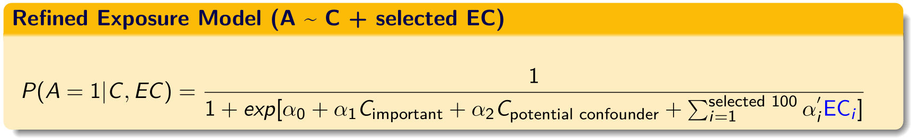
```

---

## Machine learning-based hdPS

### Hybrid approach (hdPS, then ML)

Start with top 500 ECs selected by Bross formula / prioritization

```{r echo=FALSE, out.width='100%', fig.align="center"}
knitr::include_graphics('images/mlhybrid.png')
```

Say, 100 ECs (associated with Y) were selected by Elastic net approach

```{r echo=FALSE, out.width='100%', fig.align="center"}

```

This approach is different than [Schneeweiss et al. (2017)](https://doi.org/10.1097/EDE.0000000000000581) Epidemiology, where prioritization was used after applying LASSO.


---

## hdPS: estimate treatment effect

[Karim et al. 2018](https://doi.org/10.1097/ede.0000000000000787) Epidemiology

```{r echo=FALSE, out.width='100%', fig.align="left"}
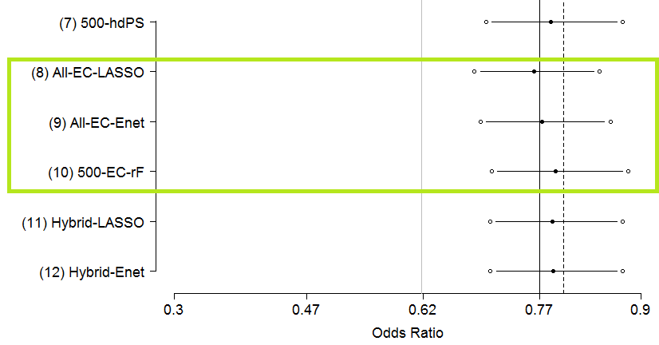
```
---


## hdPS: estimate treatment effect

[Karim et al. 2018](https://doi.org/10.1097/ede.0000000000000787) Epidemiology

```{r echo=FALSE, out.width='100%', fig.align="left"}
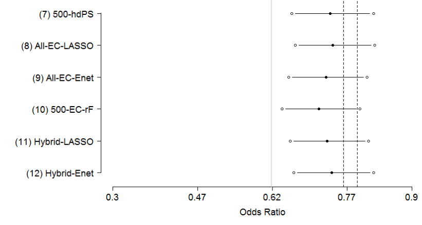
```
---

class: inverse, center, middle

# New research since 2018


---

## hdPS: estimate treatment effect

[Schneeweiss et al. 2018](https://dx.doi.org/10.2147/CLEP.S166545) Clinical Epidemiology: [CC BY license](http://creativecommons.org/licenses/by-nc/3.0/)

```{r echo=FALSE, out.width='100%', fig.align="left"}
knitr::include_graphics('images/hdpsonly.png')
```


---

```{r echo=FALSE, out.width='45%', fig.align="right"}
knitr::include_graphics('images/tbpaper.png')
```

Basham et al. 2021 [EClinicalMedicine](https://doi.org/10.1016/j.eclinm.2021.100752): [CC BY license](http://creativecommons.org/licenses/by/4.0/)

```{r echo=FALSE, out.width='100%', fig.align="center"}
knitr::include_graphics('images/tbanalysis.png')
```


---

class: center, middle

# Thanks!

### http://ehsank.com/

