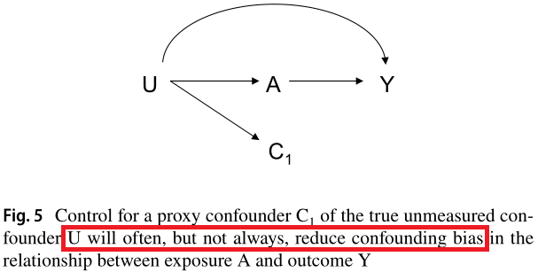

```{r setup, include=FALSE}
options(htmltools.dir.version = FALSE)
```

# Outline

---

## Motivating Example


```{r echo=FALSE, out.width='30%', fig.align="right"}

```

[Basham et al. 2021](https://doi.org/10.1016/j.eclinm.2021.100752) EClinicalMedicine: [CC BY license](http://creativecommons.org/licenses/by/4.0/)

```{r echo=FALSE, out.width='70%', fig.align="center"}

```

---

## Health care database: Advantages vs Disadvantages


.pull-left[
1. Larger sample size;

1. Diverse population;

1. Longitudinal records /many years;

1. Detailed health encounters, comorbidity history, drug exposure history;

1. possibility to link other databases.
]

.pull-right[
1. Not specifically designed for answering a particular research question;

1. Data sparsity: data collection relies on visits and encounters;

1. No control over which factors were measured.
]

.footnote[[*] TLDR: May not have all confounders in the data.]


---

## Principles of confounder selection

**Modified disjunctive cause criterion**

Adjust for variables that are 
- causes of exposure or outcome or both,  
- discard: known instrument, 
- including good proxies for unmeasured common causes

[VanderWeele et al. 2019](https://doi.org/10.1007/s10654-019-00494-6) European Journal of Epidemiology: [CC BY license](http://creativecommons.org/licenses/by/4.0/)

```{r echo=FALSE, out.width='80%', fig.align="center"}

```

---

## High-dimensional proxy information

[Schneeweiss et al. 2018](https://dx.doi.org/10.2147/CLEP.S166545) Clinical Epidemiology: [CC BY license](http://creativecommons.org/licenses/by-nc/3.0/)

```{r echo=FALSE, out.width='100%', fig.align="center"}
knitr::include_graphics('images/hdpscov.png')
```

---

## High-dimensional proxy information

- Adjusting for something that **may not be interpretable** directly with the context of the research question. 

- Logic: measures from same subject should be **correlated** = has relevant proxy information


```{r cite, cache= TRUE, echo= FALSE, warning=FALSE, message=FALSE, fig.align="center",out.width='50%'}
library(scholar)
SSalzberg <- "XzOhFPoAAAAJ"
all_pubs <- get_publications(SSalzberg)
## next step is cosmetic -- the equivalent of stringsAsFactors=FALSE
all_pubs <- as.data.frame(lapply(all_pubs,
                                 function(x) if (is.factor(x)) as.character(x) else x))
ch <- get_article_cite_history(SSalzberg,"eQOLeE2rZwMC")
vals <- ch$cites
names(vals) <- ch$year
mp <- barplot(vals,ylim=c(0,130))
title("Citation of Schneeweiss et al. (2009)")
text(mp, vals, labels = vals, pos = 3)
```


---

## High-dimensional proxy information

Collection of proxy data for the unmeasured + mis-measured variables:

```{r echo=FALSE, out.width='80%', fig.align="center"}

```

---

## High-dimensional proxy information

List of additional proxy variables (empirical covariates / EC):

| Practice (Dimension 1)             | Diagnostic (Dimension 2)           | Procedure (Dimension 3)           | Medication (Dimension 4)           |
|----------------------|----------------------|---------------------|----------------------|
| EC-dim1-1-once       | EC-dim2-1-once       | EC-dim3-1-once      | EC-dim4-1-once       |
| EC-dim1-1-sporadic   | EC-dim2-1-sporadic   | EC-dim3-1-sporadic  | EC-dim4-1-sporadic   |
| EC-dim1-1-frequent   | EC-dim2-1-frequent   | EC-dim3-1-frequent  | EC-dim4-1-frequent   |
| $\ldots$             | $\ldots$             | $\ldots$            | $\ldots$            |
| EC-dim1-686-frequent | EC-dim2-328-frequent | EC-dim3-76-frequent | EC-dim4-284-frequent |


- 4 dimension $\times$ 3 intensity $\times$ 200 most prevalent codes = 2,400 ECs
- Too many covariates to adjust? 


---
## hdPS mechanism: find useful ECs


```{r echo=FALSE, out.width='95%', fig.align="left"}
knitr::include_graphics('images/eq1.png')
```

---


## hdPS mechanism: find useful ECs


```{r echo=FALSE, out.width='100%', fig.align="left"}
knitr::include_graphics('images/eq2.png')
```

---

## Select hdPS variables from ECs

Rank (descending) each EC by the magnitude of log-bias: Absolute  $log-Bias_M$


| Rank by bias | Absolute $log-Bias_M$ | EC |
|--------------|-------------------------|----------------------|
| 1            | 0.42                    | EC-dim1-21-once      |
| 2            | 0.32                    | EC-dim2-95-once      |
| 3            | 0.25                    | EC-dim4-289-once     |
| $\ldots$     | $\ldots$                | $\ldots$             |
| 2,400        | 0.01                    | EC-dim4-64-frequent  |


Take top 200 or 500 of these ECs. These are hdPS variables.

---

## hdPS: estimate treatment effect

[Schneeweiss et al. 2018](https://dx.doi.org/10.2147/CLEP.S166545) Clinical Epidemiology: [CC BY license](http://creativecommons.org/licenses/by-nc/3.0/)

```{r echo=FALSE, out.width='100%', fig.align="left"}
knitr::include_graphics('images/hdpsonly.png')
```


---

```{r echo=FALSE, out.width='45%', fig.align="right"}

```

Basham et al. 2021 [EClinicalMedicine](https://doi.org/10.1016/j.eclinm.2021.100752): [CC BY license](http://creativecommons.org/licenses/by/4.0/)

```{r echo=FALSE, out.width='100%', fig.align="center"}

```


---

class: center, middle

# Thanks!

### http://ehsank.com/

